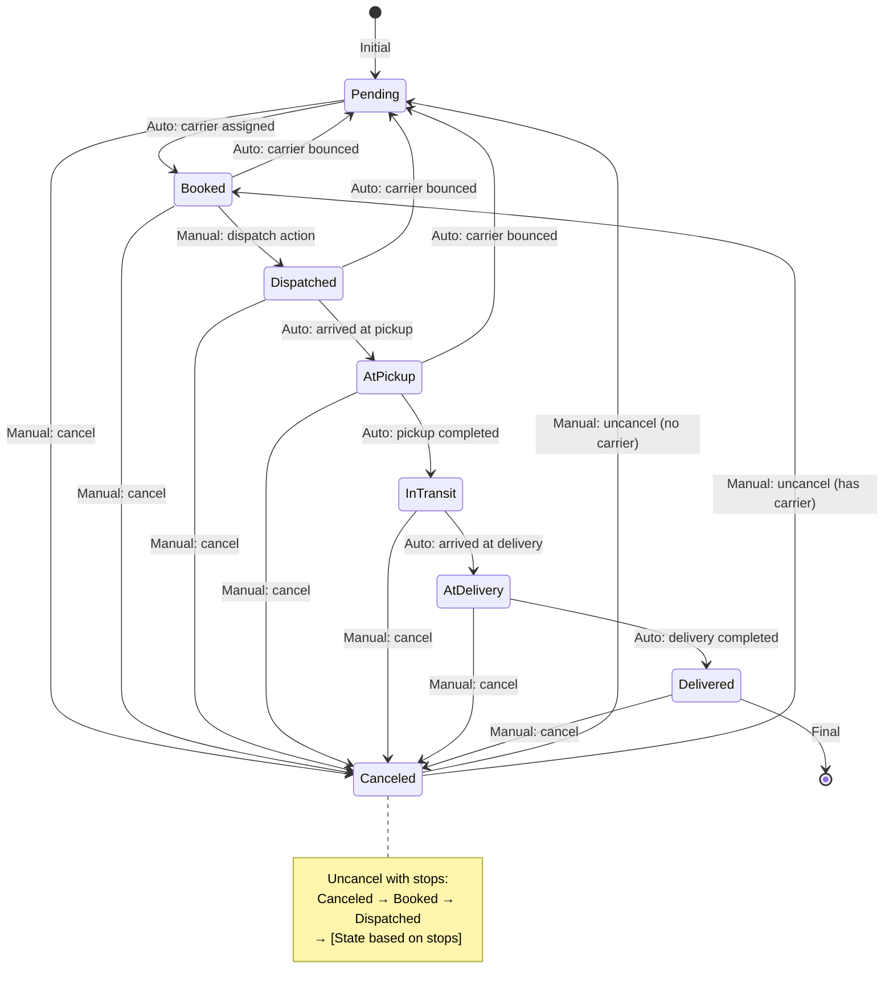

# Shipment State Machine - Complete Transition Guide

## All State Transitions

### 1. PENDING → BOOKED

| Trigger | Source | Conditions | Notes |
|---------|---------|------------|-------|
| **Automatic** | `CreateShipment` action | • Shipment created with carrier_id ≠ null | Event: `ShipmentCarrierUpdated` fired → `UpdateShipmentState::handleCarrierChanged()` |
| **Automatic** | `UpdateShipmentCarrierDetails` action | • Carrier assigned to pending shipment<br>• carrier_id ≠ null | Event: `ShipmentCarrierUpdated` fired → `UpdateShipmentState::handleCarrierChanged()` |

#### Important Note:
- Shipments created **without** a carrier remain in **Pending** state
- The transition only occurs when `carrier_id` is not null

### 2. BOOKED → DISPATCHED

| Trigger | Source | Conditions | Notes |
|---------|---------|------------|-------|
| **Manual** | `DispatchShipment` action | • User clicks dispatch button | Direct transition via `$shipment->state->transitionTo(Dispatched::class)` |

### 3. DISPATCHED → AT PICKUP

| Trigger | Source | Conditions | Notes |
|---------|---------|------------|-------|
| **Automatic** | ShipmentStop model update | • Stop with type = Pickup<br>• Stop.arrived_at timestamp set<br>• Stop is current stop | Event: `ShipmentStopsUpdated` fired → `UpdateShipmentState::handleStopsChanged()` → `ShipmentStateService::calculateStopState()` |

### 4. AT PICKUP → IN TRANSIT

| Trigger | Source | Conditions | Notes |
|---------|---------|------------|-------|
| **Automatic** | ShipmentStop model update | • Pickup stop completed<br>• Moving to next stop<br>• Not at first stop anymore | Event: `ShipmentStopsUpdated` fired → `UpdateShipmentState::handleStopsChanged()` → `ShipmentStateService::calculateStopState()` |

### 5. IN TRANSIT → AT DELIVERY

| Trigger | Source | Conditions | Notes |
|---------|---------|------------|-------|
| **Automatic** | ShipmentStop model update | • Stop with type = Delivery<br>• Stop.arrived_at timestamp set<br>• Stop is current stop | Event: `ShipmentStopsUpdated` fired → `UpdateShipmentState::handleStopsChanged()` → `ShipmentStateService::calculateStopState()` |

### 6. AT DELIVERY → DELIVERED

| Trigger | Source | Conditions | Notes |
|---------|---------|------------|-------|
| **Automatic** | ShipmentStop model update | • Last stop has loaded_unloaded_at timestamp<br>• All deliveries completed | Event: `ShipmentStopsUpdated` fired → `UpdateShipmentState::handleStopsChanged()` → `ShipmentStateService::calculateStopState()` |

### 7. CARRIER BOUNCE TRANSITIONS (→ PENDING)

| From State | Trigger | Source | Conditions | Notes |
|------------|---------|---------|------------|-------|
| **Booked** | `BounceCarrier` action | User bounces carrier | • Shipment in Booked state | Event: `ShipmentCarrierBounced` fired → `UpdateShipmentState::handleCarrierBounced()` |
| **Dispatched** | `BounceCarrier` action | User bounces carrier | • Shipment in Dispatched state | Event: `ShipmentCarrierBounced` fired → `UpdateShipmentState::handleCarrierBounced()` |
| **AtPickup** | `BounceCarrier` action | User bounces carrier | • Shipment in AtPickup state | Event: `ShipmentCarrierBounced` fired → `UpdateShipmentState::handleCarrierBounced()` |

### 8. CANCEL TRANSITIONS (ANY STATE → CANCELED)

| From State | Trigger | Source | Conditions | Notes |
|------------|---------|---------|------------|-------|
| **Any State** | `CancelShipment` action | User cancels shipment | • User has permission | Direct transition via `$shipment->state->transitionTo(Canceled::class)` |

### 9. UNCANCEL TRANSITIONS (CANCELED → VARIOUS)

| To State | Trigger | Source | Conditions | Notes |
|----------|---------|---------|------------|-------|
| **Pending** | `UncancelShipment` action | User uncancels | • No carrier assigned | Direct transition |
| **Booked** | `UncancelShipment` action | User uncancels | • Has carrier<br>• No stop progress | Direct transition |
| **Booked → Dispatched → [Calculated]** | `UncancelShipment` action | User uncancels | • Has carrier<br>• Has stop progress (arrived_at on any stop) | 1. Transition to Booked<br>2. Transition to Dispatched<br>3. Calculate final state based on stops<br>4. Transition through intermediate states |

## Event Sources and Triggers

### Model Events (Automatic)
- **ShipmentStop** model (boot method):
  - `created` → fires `ShipmentStopsUpdated`
  - `updated` → fires `ShipmentStopsUpdated`
  - `deleted` → fires `ShipmentStopsUpdated`

### Action Events
- **CreateShipment** → fires `ShipmentCarrierUpdated`
- **UpdateShipmentCarrierDetails** → fires `ShipmentCarrierUpdated`
- **BounceCarrier** → fires `ShipmentCarrierBounced`

### Direct State Transitions (No Events)
- **DispatchShipment** → Direct transition to Dispatched
- **CancelShipment** → Direct transition to Canceled
- **UncancelShipment** → Direct transitions based on conditions

## State Calculation Logic

The `ShipmentStateService::calculateStopState()` determines state from stop data:

```php
// Pseudocode of the logic:
IF no stops exist:
    return Dispatched

IF last stop has loaded_unloaded_at:
    return Delivered

IF current stop exists:
    IF current stop type = Pickup:
        return AtPickup
    IF current stop type = Delivery:
        return AtDelivery

IF next stop is NOT the first stop:
    return InTransit

return Dispatched
```

## Key Implementation Details

1. **Event Listeners**: `UpdateShipmentState` listener handles 4 events:
   - `ShipmentCarrierUpdated`
   - `ShipmentStopsUpdated`
   - `ShipmentCarrierBounced`
   - `ShipmentStateChanged`

2. **State Transition Rules**:
   - Forward transitions emit events for each intermediate state
   - Backward transitions update directly without events
   - Only allowed transitions defined in `ShipmentState::config()` can occur

3. **Stop Progress Detection**:
   - `arrived_at` - Driver arrived at stop
   - `loaded_unloaded_at` - Stop completed
   - `left_at` - Driver left stop
   - Current stop determined by these timestamps

4. **Files Involved**:
   - States: `/app/States/Shipments/*.php`
   - Listener: `/app/Listeners/Shipments/UpdateShipmentState.php:40`
   - Service: `/app/Services/Shipments/ShipmentStateService.php:20`
   - Model: `/app/Models/Shipments/ShipmentStop.php:58-76`
   - Actions: Various in `/app/Actions/`

## Visual State Diagram

